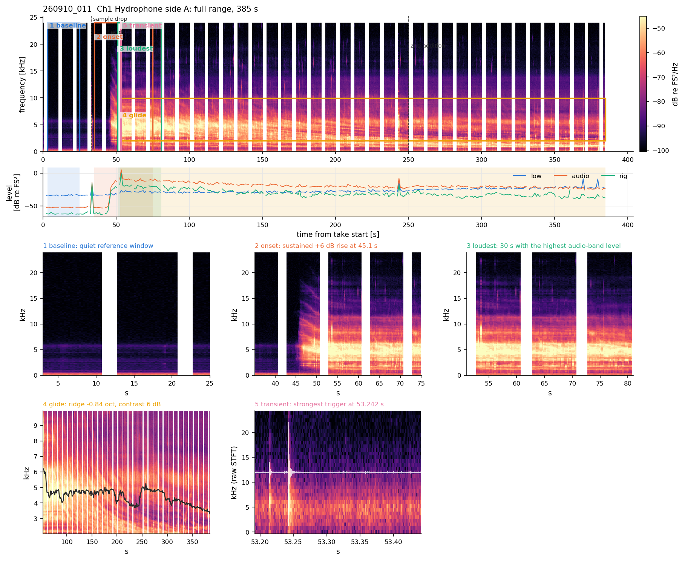

# zoom-acoustics toolkit

Passive-acoustic analysis of multi-channel **Zoom F-series** (F6/F8/F3) recordings, built for
bubble and reaction acoustics (e.g. calcite dissolving in HCl): spectrograms, band levels, event
(transient) detection, event catalogues and clustering, glide (descending spectral ridge) tracking,
variation over hours to days across many takes, and alignment with a **pH** (or any other logger)
time series.

It works with **1 to 8 channels**, and takes in one folder can have different channel sets. It
handles the three file layouts the recorder writes (poly files, split `_0001/_0002` files, mono
`_TrN` files), any sample rate, and files of any size. Everything is streamed, and a 2 GB take
needs about 0.6 GB of RAM.

```
recorder WAVs ──► discover takes ──► one streaming pass per take ──► cached feature bundle
 (+ pH log)        (io.py)            (features.py: filters, PSD,      (level, psd, env, events)
                                        STA/LTA detector)                    │
                                                                             ▼
                              notebooks 01-09  ◄──  Features / views / timeline / ph / correlate / catalogue / glide / plots
```

## Install (once)

```bash
conda env create -f environment.yml
conda activate zoom-acoustics
pip install -e .
python -m pytest            # 65 tests, ~5 s. All must pass.
```

## What it looks like

A real take (Sep-2026, calcite in 1 M HCl, 4 channels): the whole take, band levels, and zooms chosen by the
analysis (baseline, onset, loudest part, a glide, and one event from the raw audio).



More in [examples/](examples/README.md).

## Try it on the synthetic demo data first (5 minutes)

```bash
python -m zoom_acoustics demo demo_data                  # writes ~265 MB of fake recordings + a pH log
python -m zoom_acoustics process config/demo.yaml        # ~10 s
jupyter lab notebooks/
```

Then open the notebooks in order. They run unchanged on the demo; the demo has a known answer
(see [docs/VALIDATION.md](docs/VALIDATION.md)), so you can see what "working" looks like.

## Use it on your own data

1. Copy `config/TEMPLATE.yaml` to `config/local_<experiment>.yaml` (git-ignored). Set `data_dir`,
   channel names, the pH file, and any clock offsets. Every path lives here and nowhere else.
2. In each notebook, change the `CONFIG = ...` line in the **YOUR SETTINGS** cell (and the take name
   and time windows).
3. Read [docs/STUDENT_GUIDE.md](docs/STUDENT_GUIDE.md) before interpreting anything. It lists the
   mistakes that have already been made on this kind of data, with numbers.

| notebook | what it does |
|---|---|
| `00_setup_and_inventory` | environment check, list takes (start time, duration, channels, split files), cache size |
| `01_quicklook_one_take` | raw waveforms, process one take, spectrogram, band levels |
| `02_process_all_takes` | batch-process everything (cached; re-running is cheap), summary table |
| `03_single_take_analysis` | masks (chirps), spectrogram, Δlevel vs baseline, spectra + excess, onset, trigger rate, detector check |
| `04_time_variation_and_pH` | all takes on one lab-clock axis, pH loading, excess power vs pH, lag correlation, CSV export |
| `05_compare_takes` | same channel across takes: spectra, within-take changes, trigger rates |
| `06_event_catalogue_and_clustering` | clustering in time (CV, Fano, bursts), cross-channel coincidence, waveform features, correlation clusters (repeaters), feature-space clusters, catalogue CSV |
| `07_glide_analysis` | descending spectral ridges: tracking per channel, significance, harmonic ladder, following a ridge across takes, **interpretation** (growing bubble vs bubbly layer) |
| `08_acoustics_vs_pH_correlation` | level in any narrow band, excess, trigger rate (all / loud events) vs pH and dpH/dt; lags; effective sample size; third-octave band scan |
| `09_real_example_sep2026` | a real 4-channel take and the strongest real glide, executed with outputs (data not in the repo) |

All notebooks are committed **with their outputs** (demo data; notebook 09 real data), so every figure is
visible on GitHub before you run anything. `examples/` holds complete figure sets of real takes.

Command line (for long batch runs):

```bash
python -m zoom_acoustics list    config/local_x.yaml     # takes found
python -m zoom_acoustics plan    config/local_x.yaml     # parameters + cache size per take
python -m zoom_acoustics process config/local_x.yaml [take ...] [--force]
```

## Layout

```
zoom_acoustics/     the package
  io.py             WAV/BWF reading, take discovery, split/mono grouping, streaming blocks
  config.py         YAML config, channel names/sensor types, per-take options
  dsp.py            filters, band power (rectangle rule), onset, streaming STA/LTA detector
  features.py       single-pass processing -> cached bundle; Features reader class
  masks.py          excluded time windows, periodic (chirp) finder
  timeline.py       many takes on one lab-clock axis; window tables
  ph.py             pH/logger loading (csv/xlsx, several time formats), alignment, lag correlation
  physics.py        Minnaert resonance (use with care, see the guide)
  catalogue.py      waveform snippets + features, temporal clustering, coincidence, waveform clustering
  glide.py          excess spectrogram, ridge tracker, significance, harmonic ladder, interpretation
  views.py          full range + automatic zooms, difference images, raw-audio event zoom
  correlate.py      narrow-band timelines, dpH/dt, lagged correlation with n_eff, band scan
  report.py         save_figure_set: the standard figure set of one take + INDEX.md
  plots.py          standard figures (any channel count, fixed colour per channel)
  demo.py           synthetic dataset with ground truth
notebooks/          00-09, the student workflow (committed with outputs)
examples/           complete figure sets of real takes 260910_011, 260910_016 and the demo
config/             TEMPLATE.yaml (copy this), demo.yaml
tests/              pytest suite, each gating test paired with a wrong-implementation control
validation/         demo_recovery.py (synthetic truth); real_data_crosscheck.py, real_glide_crosscheck.py (Sep-2026 data)
docs/               STUDENT_GUIDE, WALKTHROUGH (code + method), VALIDATION (evidence),
                    GLIDE_INTERPRETATION (physics of glides), figures/
THEORY.md           every equation the code implements, with units and code locations
PRIORS.md           constraints a result must satisfy before you believe it
tools/              build_notebooks.py (notebooks are generated from it)
```

## Environment

Python ≥ 3.10; numpy, scipy, pandas, matplotlib, soundfile (libsndfile), pyyaml, openpyxl; JupyterLab
for the notebooks. Tested with Python 3.11.15, numpy 2.4.3, scipy 1.17.1, pandas 3.0.2,
matplotlib 3.10.9, soundfile 0.14.0 on Linux.

## Provenance

The DSP (band filters, Welch spectrogram, envelope) reproduces the Sep-2026 `analysis4` pipeline
**bit for bit** on real Zoom F6 take 260910_011 (see [docs/VALIDATION.md](docs/VALIDATION.md), V1).
The event detector fixes two defects of that pipeline, and a regression test covers each. The glide
tracker reproduces the analysis4 ridge on take 260910_016 and adds a significance test. An independent
line-by-line review found 15 defects, all fixed, and each has a regression test (VALIDATION §2).
