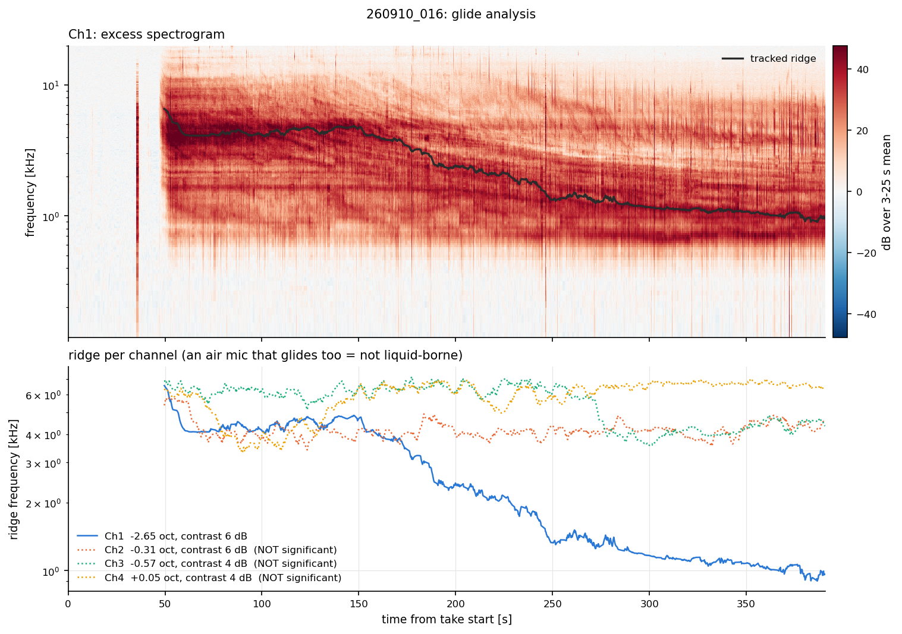
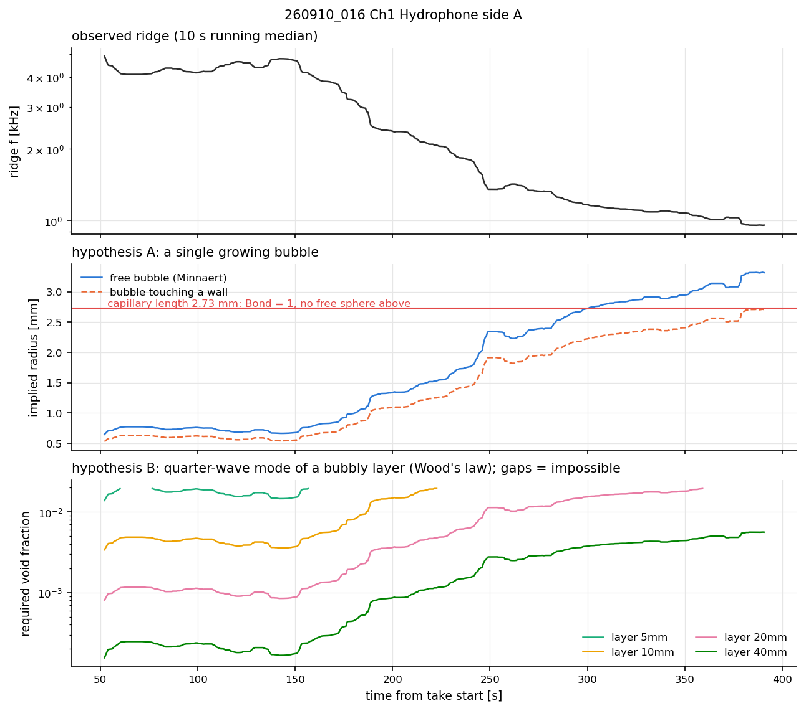

# Interpreting glides: what a descending ridge can and cannot tell you

A **glide** is a band in the *excess* spectrogram (each frame divided by a quiet baseline spectrum)
whose frequency falls smoothly or in steps over tens to hundreds of seconds after acid contact. The
clearest case in the Sep-2026 data is take 260910_016, Ch1: 6.3 → 1.0 kHz (−2.65 octaves) over
~340 s.

This guide explains, in order: (1) how to tell a real ridge from a tracking artefact; (2) the
physical mechanisms that can produce a falling frequency, with the equation behind each; (3) what
each mechanism predicts that the others do not; and (4) what the existing data do and do not
establish. The tools are `glide.track_ridge`, `summarize`, `harmonic_ladder`, `interpret` and
`plots.plot_glide_interpretation` (notebook 07).

---

## 1. Is the ridge real?

A tracker **always** returns a path, including through pure noise, and a noise path drifts. Before any
interpretation, check the following:

| check | pass | where |
|---|---|---|
| median ridge contrast (peak vs median in the search window) | clearly above the noise-path value of 2–4 dB; the toolkit's threshold is 6 dB | `summarize()["significant"]` |
| the air microphone (control) | shows no significant ridge | same, air-mic row |
| the tracker locks where you think | `t_lock_s` close to the start; the seed window contains only the ridge | `summarize()["t_lock_s"]`, figure |
| not an apparatus line | the ridge is absent in a background (water-only) take | `plot_compare_psd` |
| not a harmonic lock | the 0.5× contrast in `harmonic_ladder` is not above the controls | notebook 07 |

On take 016, only Ch1 passes (6.4 dB). The Ch2 and Ch3 "glides" reported by the earlier analysis sit
at 4.3–5.5 dB, the same as the air mic's noise path (3.9 dB) (VALIDATION V4).

**Tracker bias to know about.** The single-pole smoother lags the ridge by τ = Δt·s/(1−s) = 1.14 s at the
defaults. On a ridge falling at rate r = |d ln f/dt| the tracked frequency is high by about rτ: 0.7 % for
take 016 and 2.3 % for the fast synthetic test glide. Octave differences are unaffected.

## 2. Mechanisms that make a frequency fall

Notation: f frequency, R bubble radius, ρ = 998 kg m⁻³ water density, σ = 0.0728 N m⁻¹ surface tension,
P₀ = 101 325 Pa, κ = 1.304 polytropic exponent of CO₂ (adiabatic; → 1 isothermal), g = 9.81 m s⁻²,
c_w = 1482 m s⁻¹, β void fraction, h layer or liquid depth.

### A. One bubble growing on the surface (Minnaert resonance)

A free gas bubble rings at (Minnaert 1933, with surface tension)

  f₀(R) = [3κ(P₀ + 2σ/R) − 2σ/R]^{1/2} / (2πR√ρ),   so for R ≫ 10 µm   f₀R ≈ 3.17 m·Hz.

If the ridge is one bubble growing while attached, then R ∝ 1/f and

  d ln R/dt = −d ln f/dt,   and the gas it must receive is dV/dt = 4πR² dR/dt.

**Constraints.** (i) A bubble much larger than the capillary length ℓ_c = √(σ/ρg) = 2.73 mm is flattened by
buoyancy: Bond number Bo = (R/ℓ_c)² ≥ 1 means a spherical Minnaert reading is not self-consistent.
(ii) An attached bubble detaches once buoyancy beats the surface-tension line force. The quasi-static
(Fritz) radius is R_d = (3dσ/4ρg)^{1/3} ≈ 1.8 mm for a 1 mm contact line (`physics.fritz_departure_radius`).
Any flow sweeps bubbles off earlier, so R_d is an upper bound. (iii) A rigid wall adds radiation mass: a
bubble whose centre is a distance h from the wall rings lower by (1 + R/2h)^{−1/2} (the effect treated by
Strasberg 1953), which is 0.816 when touching. The same frequency then needs a bubble 0.816× smaller.

**Take 016, Ch1** (`glide.interpret`): R rises from 0.54 to 3.32 mm as a free bubble (Bo up to 1.49, so
not self-consistent after ~300 s), or 0.44 to 2.71 mm touching a wall (just below ℓ_c). The median growth
rate needed is 4 µm s⁻¹. A single bubble growing by ~2 mm and staying attached for 5 min, well past
R_d, is implausible for the late part but not excluded by frequency alone.

### B. Collective mode of a bubbly layer (Wood's law)

Many small bubbles make the liquid far more compressible while barely changing its density. Below the
bubbles' own resonance, the mixture sound speed follows Wood's equation

  1/(ρ_m c_m²) = (1−β)/(ρ_w c_w²) + β/(κP₀),   ρ_m ≈ (1−β)ρ_w,

giving c_m ≈ 909 m/s at β = 10⁻⁴, 354 m/s at 10⁻³ and 115 m/s at 10⁻² (`physics.wood_sound_speed`). This
linear model holds up to ~1–2 % void fraction (Commander & Prosperetti 1989). A layer of thickness h over a
rigid surface has a quarter-wave mode f = c_m/(4h). As gas accumulates, β rises, c_m falls and **f falls**
with no large bubble anywhere.

**Take 016, Ch1:** the void fraction needed rises from 9·10⁻⁵ to 6·10⁻³ for h = 40 mm, stays within the
model for h ≥ ~40 mm, and requires more than 2 % gas (outside the model) for h ≤ 20 mm. The liquid depth
was not recorded, so this mechanism can be neither confirmed nor excluded.

### C. A vessel or liquid-column mode shifting

The whole liquid column has modes (lowest ≈ c/4h for a free surface over a rigid bottom). They shift if
the depth changes (acid added, evaporation) or the bulk sound speed changes (bubbles throughout the
liquid). **Prediction:** a bulk change is seen by **every** wetted sensor at the same frequency. On take
016, Ch2 in the same dish shows no significant ridge, which argues against a bulk effect for that take.

### D. A structural mode of the sample or mount

A mass-loaded resonator shifts by Δf/f ≈ −½ Δm/m. The sample loses at most a few hundred mg of ~31 g (≤ 1.5 %),
which gives Δf/f ≲ 0.8 %. That is far too small for octaves, so mass loss alone is excluded. Gas
attaching to the sample and loading its surface is not excluded by this argument.

## 3. What distinguishes them

| test | A: growing bubble | B: bubbly layer | C: bulk / column | how to run it |
|---|---|---|---|---|
| same frequency on all wetted sensors? | yes if loud enough (source property), but may be shadowed | local to the layer; sensors near it | **yes, necessarily** | glide table per channel |
| harmonics along the ridge | integer (2×, 3×) from nonlinear forcing | quarter-wave overtones are **odd** (3×, 5×; no 2×) | depends on the mode | `harmonic_ladder` (controls 1.5×, 2.5×) |
| steps in f | detachment or coalescence gives jumps up (R down) or down | gradual unless the layer sheds | gradual | look at `interpret()` f(t) |
| scales with liquid depth | no | yes (∝ 1/h at fixed β) | yes | **repeat at two depths** |
| scales with gas production | dR/dt ∝ local gas flux | dβ/dt ∝ gas retained | no | compare glide rate with mass loss per take |
| air mic | none | none | none | control |

**Take 016, harmonics:** no multiple rises clearly above the non-integer controls (2×: 5.0 dB early,
3.6 dB late; controls 4.3–5.4 dB), so the harmonic test is **inconclusive** on this take. **Steps:**
the Ch1 ridge falls in discrete steps near 150, 187, 245 and 380 s rather than smoothly. This is
recorded as an observation; any mechanism has to account for it.

## 4. What is established, and what is not

* **Established:** on take 016 Ch1 a significant ridge descends 6.3 → 1.0 kHz. The air mic shows no
  ridge, so it is liquid- or solid-borne.
* **Not established:** the mechanism. A free single bubble is inconsistent with the late part (Bo > 1).
  A wall-attached bubble or a bubbly layer ≥ ~4 cm thick is consistent with the frequencies. Harmonics are
  unresolved.
* **Do not** quote a bubble radius from a ridge. `summarize` and `interpret` print the Bond number next to
  every radius for that reason.
* **Do not** count "gliding takes" without the contrast criterion, and state the threshold used.

## 5. Experiments that would settle it

1. **Record the liquid depth** and repeat one condition at two depths. B and C predict f ∝ 1/h; A does not
   depend on depth.
2. **A camera on the sample.** It shows directly whether one bubble grows (A) or a foam/layer builds (B).
3. **Background with injected gas:** bubble air through a needle in a water-only take at a known rate. That
   gives a layer with no chemistry.
4. **Two hydrophones on the same side** of the sample, a few cm apart. A local source (A, B) versus a bulk
   mode (C) is then a direct comparison.

## References (verified)

* Minnaert, M. (1933). On musical air-bubbles and the sounds of running water. *Philosophical Magazine* 16.
  doi:10.1080/14786443309462277
* Strasberg, M. (1953). The pulsation frequency of nonspherical gas bubbles in liquids. *J. Acoust. Soc.
  Am.* 25. doi:10.1121/1.1907076
* Commander, K. W. & Prosperetti, A. (1989). Linear pressure waves in bubbly liquids: comparison between
  theory and experiments. *J. Acoust. Soc. Am.* 85. doi:10.1121/1.397599
* Leighton, T. G. (1994). *The Acoustic Bubble*. Academic Press. (Minnaert with surface tension; damping.)
