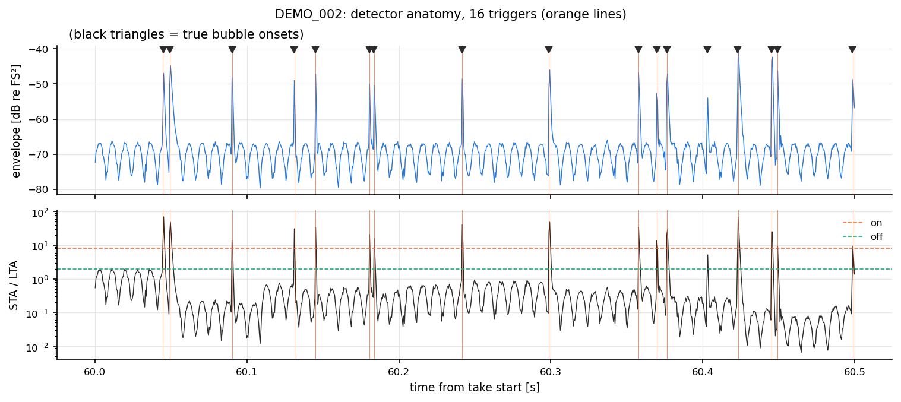
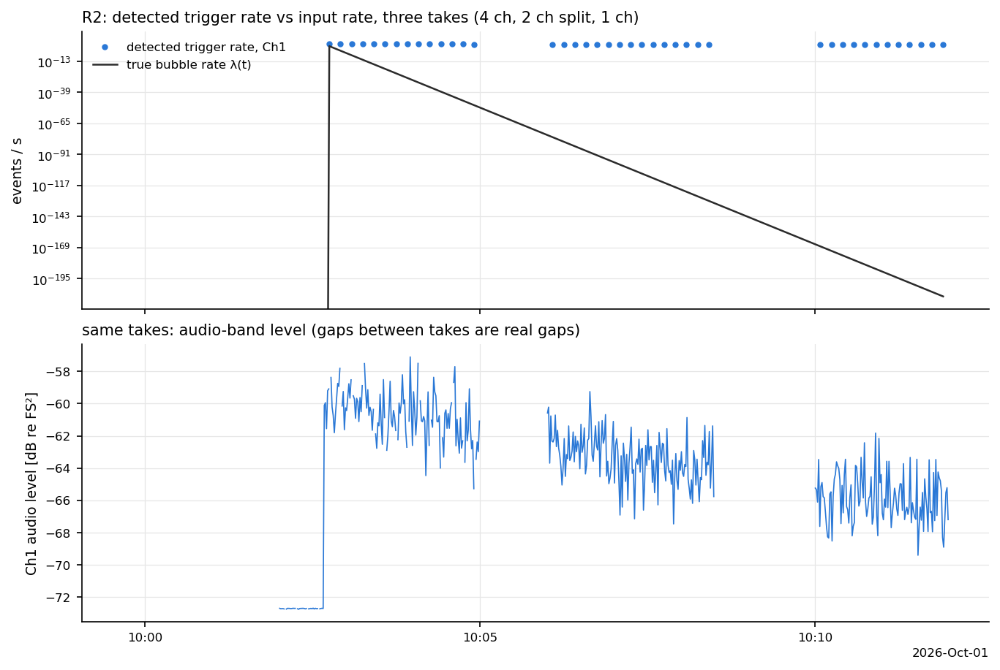
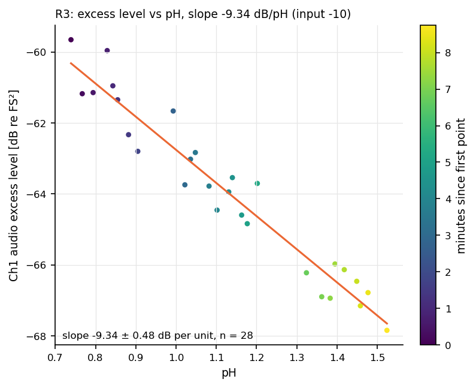
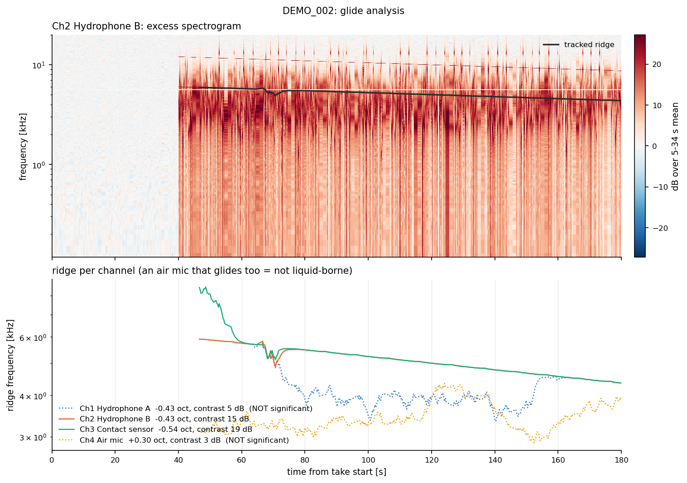
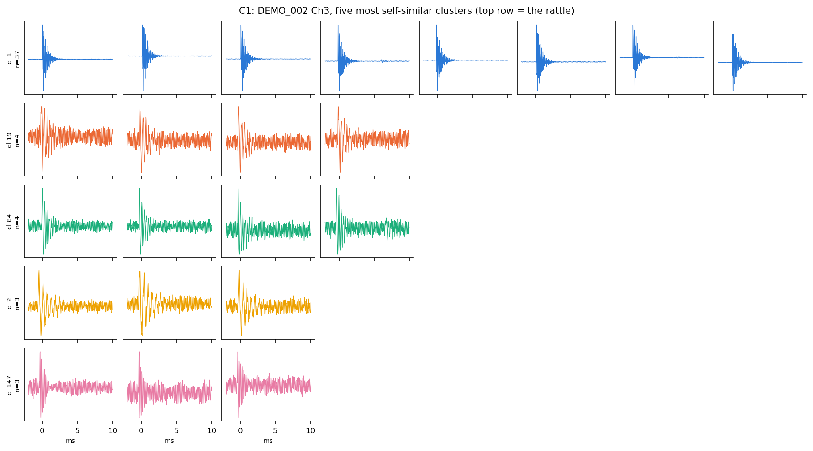
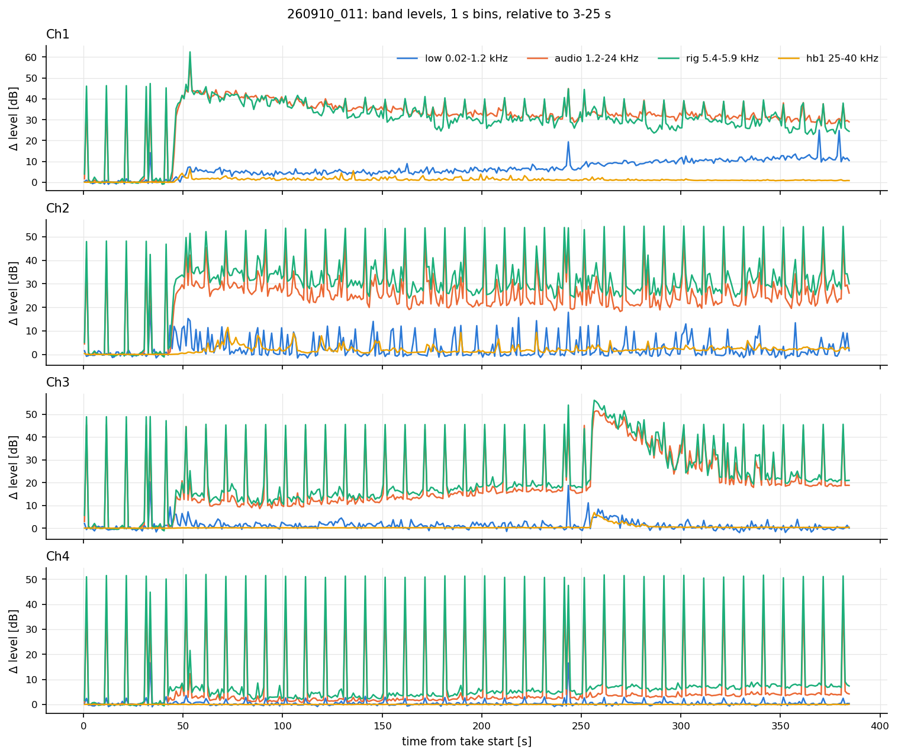
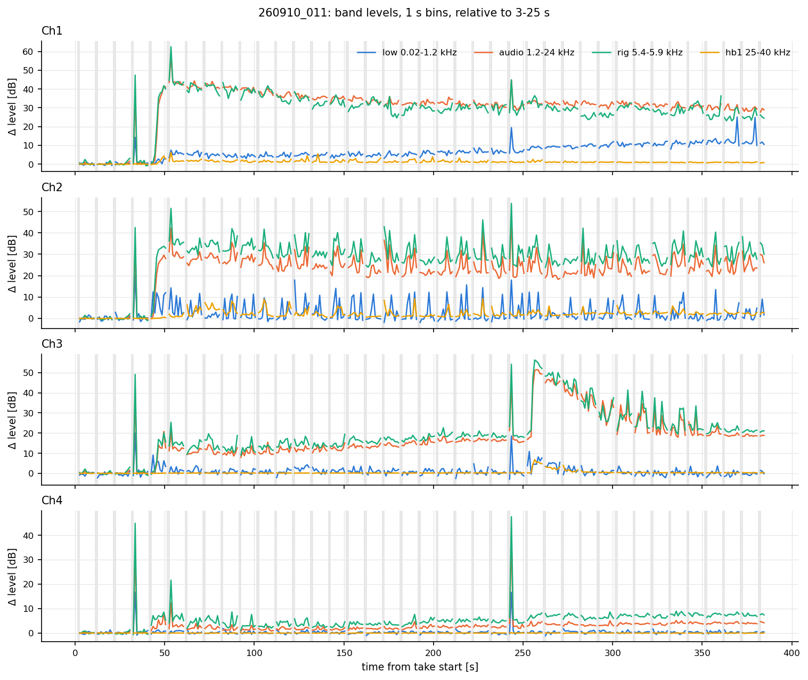
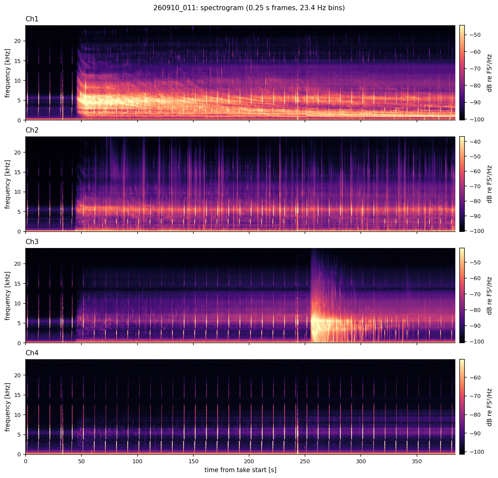

# Validation: evidence that the toolkit computes what it claims

Four layers of evidence, each checked against something independent of the code itself:

1. **Unit tests** against analytic answers. Each gating test is paired with a deliberately wrong
   implementation that the same assertion rejects (`python -m pytest`, 65 tests).
2. **Regression tests** for every defect found in an independent line-by-line code review
   (`tests/test_review_regressions.py`, §2).
3. **Synthetic recovery** on the demo dataset, where the truth is known (`validation/demo_recovery.py`).
4. **Real-data regression** against the independent Sep-2026 `analysis4` pipeline on the same Zoom F6
   files (`validation/real_data_crosscheck.py`, `validation/real_glide_crosscheck.py`; these run only
   where that data is mounted).

All numbers below are from runs on 2026-09-29 (Python 3.11.15, numpy 2.4.3, scipy 1.17.1, pandas 3.0.2).
A fresh environment built from `environment.yml` alone (48 s) passes the same suite.

---

## 1. Unit tests, with controls that must fail

| test | analytic reference | result | control (must fail) |
|---|---|---|---|
| `test_band_power_parseval_narrow_band` | white noise, σ² N Δf/(f_s/2), 21-bin band | rectangle rule < 0.05 dB | trapezoid rule > 0.15 dB off ✔ rejected |
| `test_band_power_sine` | sine: A²/2 | < 1 % | |
| `test_streaming_filter_equals_whole_signal` | one-shot `sosfilt` | < 1e-12 | filter state reset per block: > 1e-3 ✔ rejected |
| `test_onset_rejects_single_impulse` | step at 50.125 s, spike at 20.125 s | 50.125 s exactly | no hold: picks the spike ✔ |
| `test_impulse_timing_exact` | impulse at sample 900 | (900 + ½)·dt exactly | analysis4 window alignment: ≥ 59 ms late ✔ rejected |
| `test_one_trigger_per_sustained_excursion` | one 10 ms burst | 1 trigger | analysis4 immediate re-arm: ≥ 5 ✔ rejected |
| `test_block_invariance` | one-shot detector | identical for 200 random block sizes, with a mask | |
| `test_recovery_of_poisson_events` | 20 s⁻¹ impulses on χ²₂₄ noise | recall > 95 %, false < 2 % | |
| `test_levels_and_psd_of_known_tones` | 0.2 FS tone → 0.02 FS²; +20 dB step | < 1 %; 20.0 ± 0.1 dB | |
| `test_split_take_equals_single_file`, `test_block_size_does_not_matter` | unsplit / other block size | equal (1e-6 / 1e-9) | |
| `test_header_and_roundtrip[1,2,4]`, `test_mono_track_files_grouped_as_channels` | written samples and headers | bit-exact; channels [1, 2, 4] | |
| `test_real_zoom_header_layout` | real F6 file 260910_011 | 2026-09-10 15:33:20, 4 × 192 kHz | |
| `test_load_formats` | the same pH series in four file layouts | identical | elapsed without a start raises ✔ |
| `test_acoustic_at_linear_power_mean` | 0 and 10 dB → 7.40 dB | exact | |
| `test_lagged_correlation_recovers_known_lag` | 60 s shift | 60 s | |
| `test_minnaert_limits` | f₀R → 3.17 m·Hz; round trip | 1e-4; 1e-12 | κ instead of 3κ: > 40 % off ✔ rejected |
| `test_ridge_tracker_recovers_known_glide` | 4 → 1 kHz exponential glide | < 1 % vs lagged truth; octaves ± 0.03 | error vs *unlagged* truth > 1 % (smoother lag is real and documented) |
| `test_argmax_in_fixed_bands_fails_control` | same glide | | argmax in a fixed band: > 10 % error ✔ rejected |
| `test_no_ridge_is_not_significant` | pure noise | path returned but flagged not significant | |
| `test_harmonic_ladder_...` | tone + 2nd harmonic | 2× > controls + 6 dB; seeding on the harmonic → 0.5× > controls + 6 dB | |
| `test_interevent_poisson_and_mask_straddling` | Poisson, 1 s mask every 10 s | CV = 1 ± 0.05 | gaps across masks kept: CV + 0.3 ✔ rejected |
| `test_interevent_detects_bursts` | 500 bursts of 10 | CV > 2, Fano > 3, burst count within 5 % | |
| `test_coincidence_excess_over_chance` | 40 % shared events, 0.3 ms lag | excess 0.40 ± 0.05, lag 0.3 ms; independent: < 0.03 | |
| `test_waveform_features_and_repeater_cluster` | 60 ringdowns Q = 10 + 12 identical rattles | median Q in 8–12; top cluster = exactly the 12 rattles | |
| `test_wood_limits_and_values` | Wood's law: β → 0 gives c_w; gas-dominated limit | exact; < 2 % at β = 10⁻² | the old "10⁻⁴ → 300 m/s" statement: rejected (it is 909 m/s) |
| `test_layer_mode_inversion_roundtrip_and_limits` | layer mode ↔ β | round trip 1e-6; NaN outside validity | |
| `test_wall_and_fritz` | Strasberg factor √(2/3) touching; Fritz force balance | exact | |
| `test_interpret_growing_bubble_bond_flag` | bubble growing 10 µm/s | R(t), dR/dt exact; Bond flag raised | |
| `test_difference_image_and_calibration` | tone after 15 s; pa_per_fs = 10 | background ≈ 0 dB, tone > 30 dB; +140 dB for µPa | |
| `test_suggest_zooms_and_overview` | onset at 15 s | onset zoom brackets it | |
| `test_n_eff_white_vs_smooth` | white vs 20-point smoothed noise | n_eff ≈ n vs ≈ n/10 | |
| `test_spurious_correlation_of_two_trends_is_not_significant` | two independent random walks | n_eff < 40, p(n_eff) ≫ naive p | naive p (n = 200) ~1e-50 ✔ rejected |
| `test_correlate_recovers_lag_and_slope` | pH = −0.1 × level, 30 s later | lag 30 s, slope −0.10 | |
| `test_ph_rate`, `test_band_level_from_psd_matches_tone` | linear pH ramp; tone A²/2 | exact; < 1 % | |
| `test_yaml_keeps_zoom_take_names_as_strings` | `260910_011:` key | stays a string | plain YAML reads int 260910011 ✔ (the trap) |

## 2. Independent code review and its regression tests

A separate reviewer read every module line by line and confirmed each finding numerically. Each fixed
finding now has a test in `tests/test_review_regressions.py`:

| # | finding (before the fix) | fix | test |
|---|---|---|---|
| 1 | dd/mm pH logs crossing the 12th→13th parsed half month-first, then silently reordered | both readings compared; ambiguity raises; `dayfirst` config; ISO dates exempt | `test_ambiguous_day_month_is_refused` |
| 2 | tz-aware timestamps shifted to UTC (4 h off vs the recorder's wall clock) | keep wall clock | `test_timezone_aware_keeps_wall_clock` |
| 3 | a time-of-day-only column got *today's* date → no overlap, silent | detected; needs `date_col` or `base_date`; midnight wrap | `test_time_only_column_needs_a_date` |
| 4 | `EXP_0011.WAV` + `EXP_0012.WAV` (2 h apart) merged into one 2 s "take" | parts must be 0001, 0002, … and contiguous within 5 s | `test_four_digit_take_numbers_are_not_split_parts` |
| 5 | poly file next to an `_LR` mix → channels numbered from 0 | mixes skipped; poly always 1..N | `test_poly_next_to_mix_file_is_one_based` |
| 6 | same file name in two folders → caches overwrote each other | `<folder>__<name>` | `test_same_name_in_two_folders` |
| 7 | clock offset applied twice to elapsed-time logs | `elapsed_start` is lab time | `test_elapsed_start_is_lab_time_...` |
| 8 | masks O(N × W): ~1 min per rate call on a 24 h chirped take | `searchsorted`, O(N log W) | `test_mask_array_matches_naive_and_is_fast` |
| 9 | trigger live time off by lta/2 at start and after each mask (THEORY disagreed) | `detector_dead_windows` | `test_event_rate_live_time_matches_detector` |
| 10 | band clipped at 0.95 f_N became a high-pass, but its label kept the clipped edge | stored edge = f_N | `test_band_edges_are_the_filters_edges` |
| 11 | `block_s` ignored at 44.1 kHz (5.5 s or ~200 s blocks) | nested hops | `test_block_s_is_honoured[44100/96000]` |
| 12 | `elapsed_unit="minutes"` KeyError; decimal-comma CSV → all-NaN | long unit names; comma decimals | tests above + `test_decimal_comma` |
| 13 | every mono file named "Tr1" | names from iXML | `test_mono_track_names_from_ixml` |
| 14 | `summary()` ignored masks added later | uses `event_rate` | `test_summary_honours_added_masks` |
| 15 | NaN samples silently zeroed | counted, noted, printed | `test_nonfinite_samples_are_reported` |

The reviewer also confirmed as correct: the processing write indices across blocks and the last partial
block, split-file block boundaries, the streaming STA/LTA state, `find_onset`, `acoustic_at` and the
lag-correlation sign, and the full pipeline at 44.1 kHz and for 1- and 2-channel takes.

## 3. Synthetic recovery (demo dataset, known truth)

Demo contents are in THEORY §9: Poisson bubbles at λ(t) = 40 e^{−(t−t_acid)/300 s} s⁻¹, a glide
6 → 1.5 kHz over 600 s with a 2nd harmonic on Ch1–3 only, a repeating two-tone "rattle" in DEMO_002,
chirps, and a pH log with −10 dB per pH unit by construction.

**R1: event timing** (Ch1, 1 ms tolerance).

| take | true bubbles | triggers | recall | triggers without a bubble | recall, isolated (> 20 ms) |
|---|---|---|---|---|---|
| DEMO_002 (40 → 25 s⁻¹) | 3696 | 2893 | 80.4 % | 1.3 % (the rattle: real events, not bubbles) | 88.8 % |
| DEMO_004 (9 → 6 s⁻¹) | 902 | 857 | 96.3 % | 0.0 % | 97.5 % |

The misses concentrate where bubbles crowd. After a loud pulse the LTA stays inflated for ~60 ms, and a
following weaker bubble cannot reach the threshold:

**R2: rate.** Detected/true 0.86 median (10–90 %: 0.75–0.98). The decay time fitted to trigger rate is
**344 s against 300 s true**, because saturation at early (high-rate) times flattens the curve. Takes with
4, 2 and 1 channels sit correctly on one lab-clock axis.

**R3: level vs pH** (28 samples). Raw level: −8.19 dB/pH. **Excess** (baseline subtracted in linear
power): **−9.34 ± 0.48**, against −10 put in. Excess removes most of the floor bias. The remaining 1.4 SE
comes from the glide tone, which adds audio-band power that is not proportional to the bubble rate, so
the level is not a pure rate proxy. On real data many things will do this.

**R4: onset.** 40.125 s detected (true 40.0 s; 0.25 s grid). The sample-drop click at 35.0 s is rejected.

**R5: chirp finder.** Period 10.000 s, 6/6 inliers. Start 5.125 s from the broadband level (true 5.1 s)
but 5.375 s from the audio band, because the sweep starts at 100 Hz and enters 1.2 kHz only after 0.47 s.

**G1: glide.** Tracked from 46 s (DEMO_002) or the take start, seed 1–12 kHz, baseline DEMO_002 5–34 s.
Truth is evaluated at the edge-window times and corrected for the smoother lag τ = 1.14 s.

| take | ch | octaves | true | contrast [dB] | significant |
|---|---|---|---|---|---|
| DEMO_002 | 1 hydrophone A | −0.432 | −0.434 | 5.1 | **no** (bubble continuum buries the tone) |
| DEMO_002 | 2 hydrophone B | −0.432 | −0.434 | 14.7 | yes |
| DEMO_002 | 3 contact | −0.544 | −0.408 | 18.7 | yes, but seeded on the 9 kHz rattle; lock at 54.4 s |
| DEMO_002 | 3, seed 4–8 kHz | −0.432 | −0.434 | | yes |
| DEMO_002 | 4 air mic (no ridge) | +0.302 | (none) | 2.8 | **no** ✔ |
| DEMO_003 | 1, 2 (split file, 2 ch) | −0.482 | −0.486 | 14.7, 17.3 | yes |
| DEMO_004 | 1 (mono file) | −0.380 | −0.386 | 25.5 | yes |

The Ch3 row shows the seed trap. A seed window that contains another feature starts the track there, and
a short edge window then includes the slide onto the ridge. The fix is a seed window that excludes it.
The air mic, which has no ridge at all, still gets a path that "glides" +0.30 octaves. Only the contrast
criterion (2.8 dB) exposes it.

Harmonic ladder on Ch2: 1× 14.9 dB, **2× 21.9 dB**, 3× 2.6, 4× 2.7, 0.5× 1.8, controls (1.5×, 2.5×)
2.3–2.5 dB. The 2nd harmonic that was put in is found, and nothing else is.

**C1: waveform clustering** (DEMO_002, 600 random triggers per channel, ρ ≥ 0.8).

| channel | rattles in sample | top cluster | its median ρ | next best ρ | rattle members of top |
|---|---|---|---|---|---|
| Ch3 contact (rattle loud) | 37 | 37 events | 0.94 | 0.87 | **37 / 37** |
| Ch1 hydrophone (rattle weaker) | 11 | 30 bubbles | 0.883 | 0.878 | 0 (the rattle cluster ties with bubble clusters) |

Clustering finds the repeater only where it is clearly more self-similar than the bubble population.
Bubbles of similar frequency form tight clusters too (20 to 60 "candidates" of ≥ 3 events), and many Ch3
clusters sit on the 5.6 kHz rig tone. Per-event features validate: median Q estimate 8.07 on Ch1 (Q = 8
input), median peak frequency 4.5 kHz (Minnaert frequency of the 0.7 mm median radius).

## 4. Real data (Zoom F6, Dataset2, 4 ch, 192 kHz, 32-bit float)

**V1: bit-for-bit agreement with analysis4 on take 260910_011** (385 s). Same band edges and Welch
settings, different code:

| quantity | max relative difference, per channel |
|---|---|
| Welch PSD, 1539 frames × 4097 bins | 0, 0, 0, 0 |
| audio-band envelope (0.5 ms), 769 969 samples | 0, 0, 0, 0 |
| 0.25 s level vs analysis4 envelope block-averaged | 6.1e-8, 6.4e-8, 7.7e-8, 5.9e-8 (float32) |

Processing took 40 s (9.5× real time) with a peak memory of 0.65 GB.

**V2: detector logic on identical envelopes.** The analysis4 code re-armed immediately after firing, so
its `off` threshold had no effect:

| | Ch1 | Ch2 | Ch3 | Ch4 |
|---|---|---|---|---|
| hysteresis (this toolkit) | 5389 | 6567 | 4102 | 388 |
| analysis4 logic | 6856 | 7156 | 4462 | 488 |
| inflation | ×1.27 | ×1.09 | ×1.09 | ×1.26 |

Part of the "1.24 triggers per bubble" reported in Sep 2026 may be this re-arm artefact. That is not
proven here, because those counts had chirps masked and this comparison does not.

**V3: chirp masking.** 39/40 bursts on the generator's 10.000 s grid (first at 1.375 s); 16.7 % of the take
masked. The periodic spikes disappear. What remains is the acid onset (~45 s, Ch1–3), the sample-drop markers
(~33 s, ~243 s, all channels) and the second acid addition on the contact sensor (~255 s).

**V4: glide on take 260910_016** (the strongest case in Sep 2026). Same start (49.5 s), seed (4–12 kHz),
baseline (3–25 s) and chirp mask as analysis4:

| channel | this toolkit, octaves | analysis4, octaves | f start / end [Hz] (this; a4) | contrast [dB] | significant |
|---|---|---|---|---|---|
| Ch1 | −2.65 | −2.84 | 6298 / 1019 ; 6525 / 910 | 6.4 | **yes** |
| Ch2 | −0.31 | −0.37 | 5548 / … ; 5502 / 4250 | 5.5 | no |
| Ch3 | −0.57 | −0.58 | 6762 / … ; 6888 / 4612 | 4.3 | no |
| Ch4 air | +0.05 | +0.04 | 6218 / … ; 6314 / 6494 | 3.9 | no |

The Ch1 ridge is confirmed (6.3 → 1.0 kHz). The difference in octaves comes from the end points:
analysis4 used single frames, this toolkit uses 3 s medians of the locked track. **New:** by the contrast
criterion, the Ch2 and Ch3 "glides" of analysis4 are indistinguishable from the air mic's noise path
(4.3–5.5 dB against 3.9 dB). On this take only Ch1 carries a significant ridge. The Sep-2026 summary
counted 4–5 gliding takes per wetted channel. That count should be redone with a contrast criterion, and
the result depends on the chosen threshold (6 dB here).

**V5: harmonics and interpretation of the 016 ridge.** Harmonic ladder, Ch1: 2× 5.0 dB (early) / 3.6 dB
(late) against controls 4.3–5.4 dB, so **inconclusive**. Interpretation: free bubble 0.54–3.32 mm (Bond up to
1.49, not self-consistent); wall-attached bubble 0.44–2.71 mm; bubbly layer needs β 9·10⁻⁵–6·10⁻³ at
h = 40 mm and is outside the model for h ≤ 20 mm. See docs/GLIDE_INTERPRETATION.md.

**Config trap found while building the examples:** YAML 1.1 reads the unquoted key `260910_011` as the
integer 260910011, so the per-take chirp masks were silently ignored and the baseline mean was dominated by
chirps. The loader now keeps underscored numbers as strings (test above), and notebook 00 warns about config
take names that match no take.

**Correlation on the demo** (notebook 08): every third-octave band correlates with pH at |r| ≈ 0.9, but
n_eff = 2, so nothing is significant. This is the correct result for one monotonic run. The regression
slope is still right (−0.08 against −0.10 pH per dB).

## 5. Notebooks

All ten notebooks (00–09) are executed by `python tools/build_notebooks.py --execute` and committed with
their outputs: 00–08 on the demo dataset, 09 on the real Sep-2026 takes. They run with no errors (39 embedded
figures), and the figures were inspected.

## 6. What is not validated

* No calibrated acoustic source: every level is relative (dB re FS).
* No real pH file has passed through the loader yet. Formats are tested on synthetic files; check the first
  real one with `ph.load_ph(...).head()` and a plot.
* Clock offsets must be measured (STUDENT_GUIDE §3). The code cannot validate them.
* Detector recall on *real* bubbles is unknown. On synthetic ones it falls with rate (R1).
* The glide significance threshold (6 dB) is a judgment call validated on synthetic noise paths
  (2.8–4 dB) and one real take. Waveform-cluster "repeater" status needs visual confirmation.
