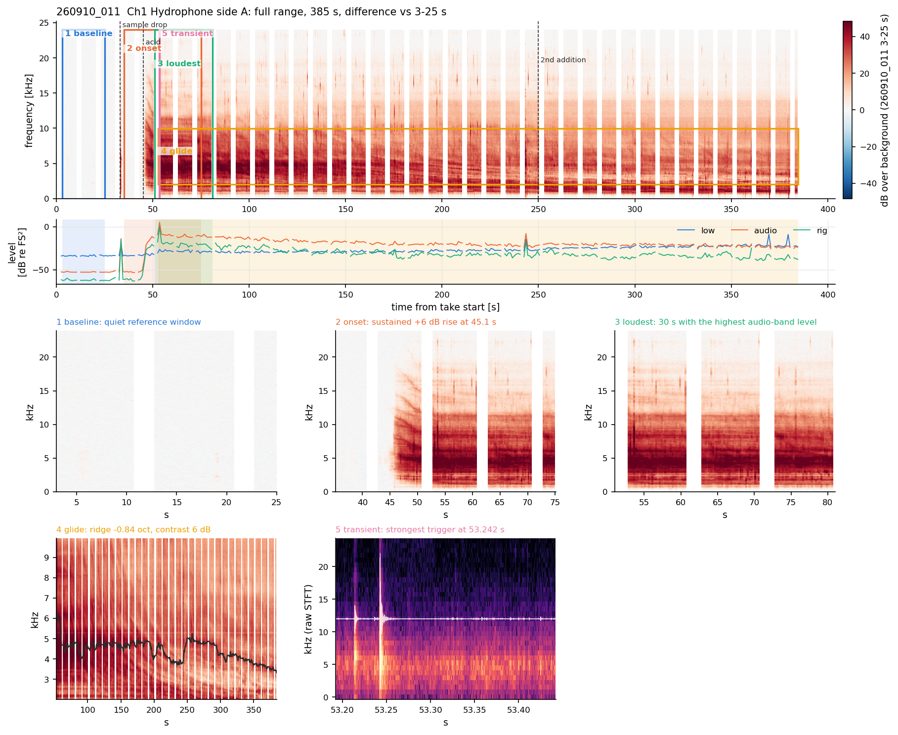

# Examples: what the standard figures look like

Each folder holds the **standard figure set** of one take, written by one call,

```python
za.report.save_figure_set(cfg, "<take>", "examples/<folder>", baseline=(t0, t1), after=(t0, t1))
```

plus an `INDEX.md` that explains every figure and a `09_summary.csv` of per-channel numbers.

| folder | take | what it shows |
|---|---|---|
| [real_260910_011](real_260910_011/INDEX.md) | Sep-2026, EXP3, 1 M HCl on calcite, 4 channels, 192 kHz | a typical reaction: onset at ~45 s, +13 to +35 dB on the wetted sensors, +2 dB on the air mic, chirps masked, a fan of descending ridges after the onset |
| [real_260910_016](real_260910_016/INDEX.md) | Sep-2026, EXP3, 0.5 M HCl | the strongest glide of the session (Ch1 6.3 -> 1.0 kHz) and its interpretation |
| [demo_DEMO_002](demo_DEMO_002/INDEX.md) | synthetic demo | the same analysis where the truth is known (bubbles, a 6 -> 1.5 kHz glide, a repeating rattle) |

The real recordings are not in the repository (1.2 GB each). `config/real_example_sep2026.yaml` and
`notebooks/09_real_example_sep2026.ipynb` show exactly how these were made.

## Take 260910_011: full range and zooms


## Take 260910_011: difference image against the pre-acid baseline



## Take 260910_016: glide and what it would require


