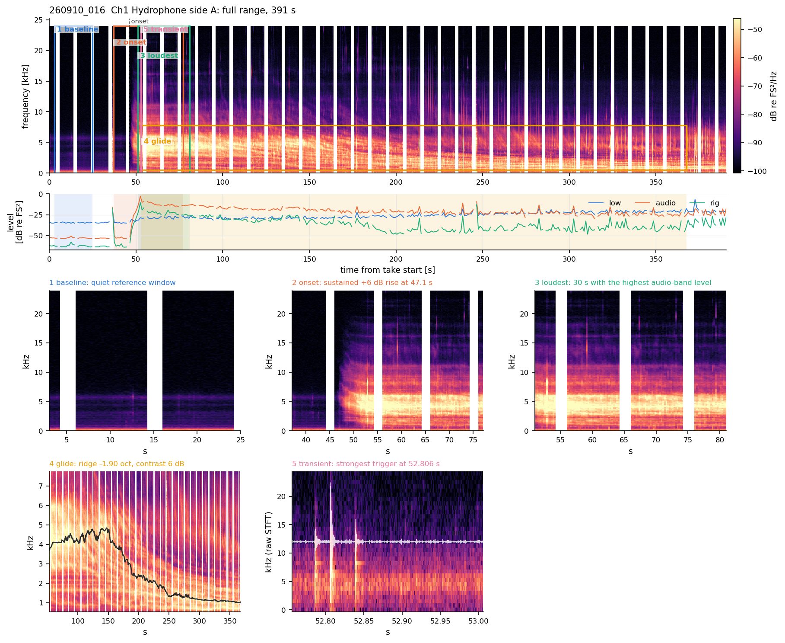
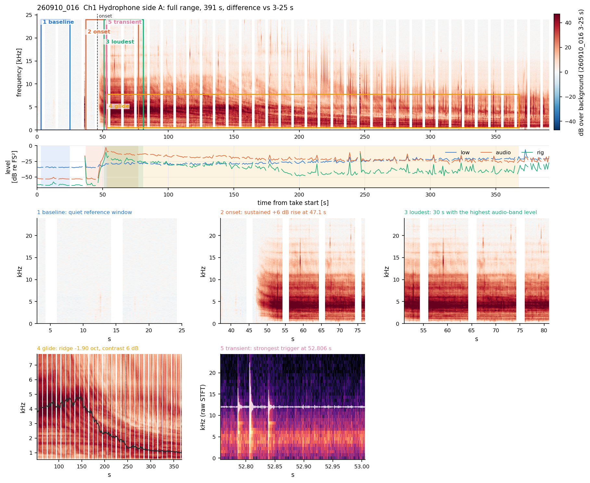
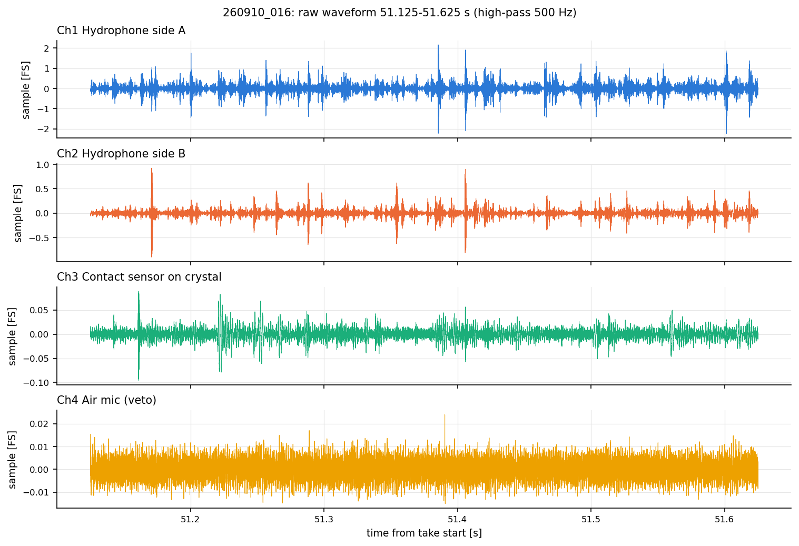
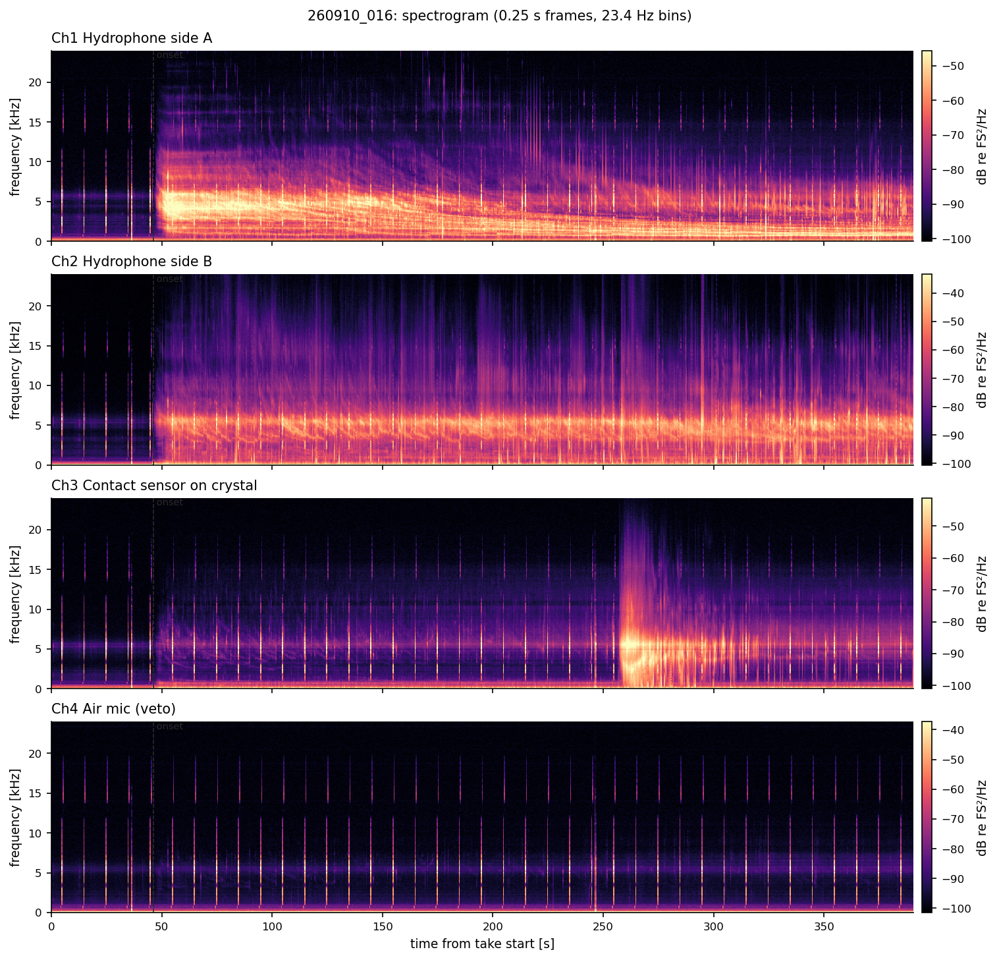
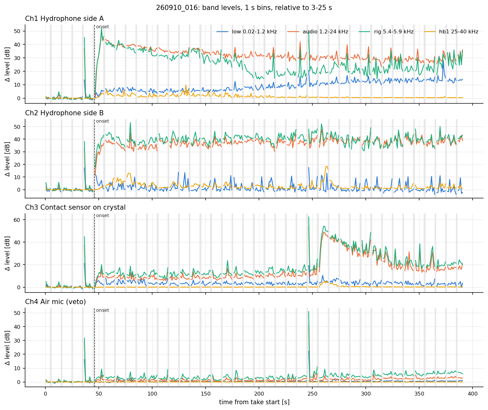
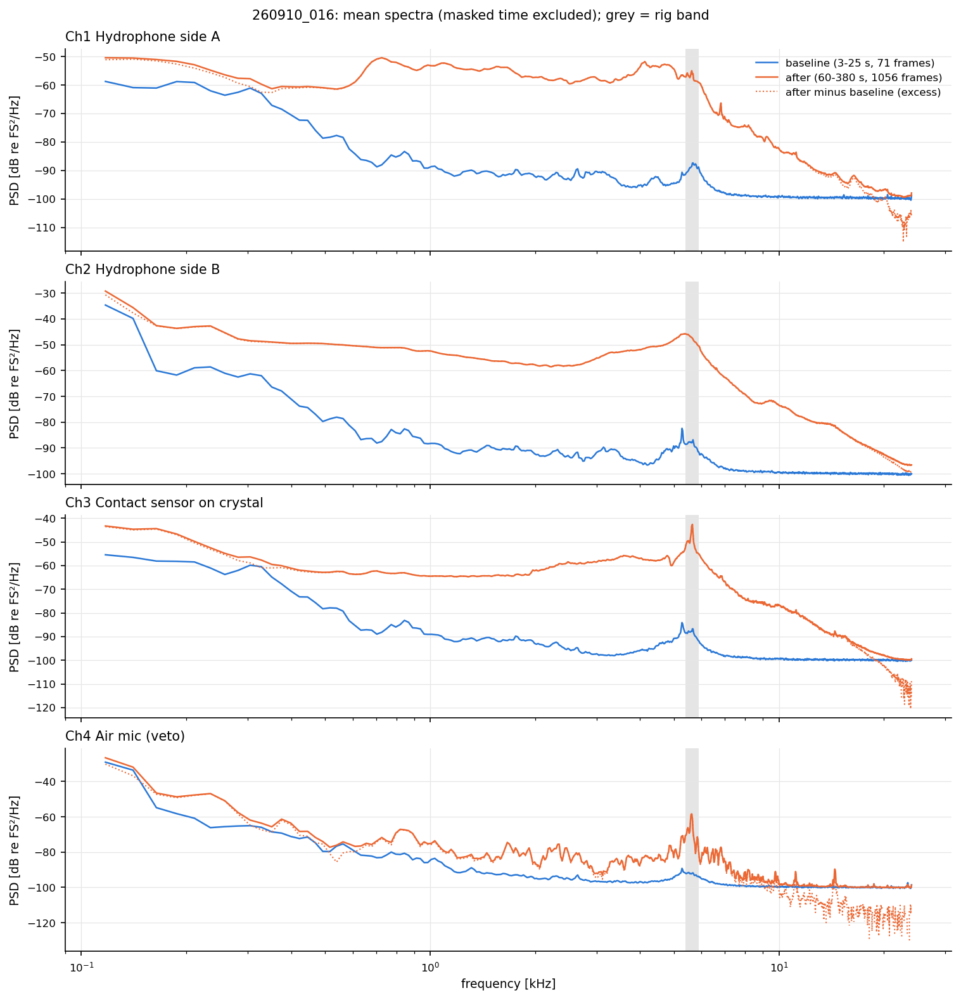
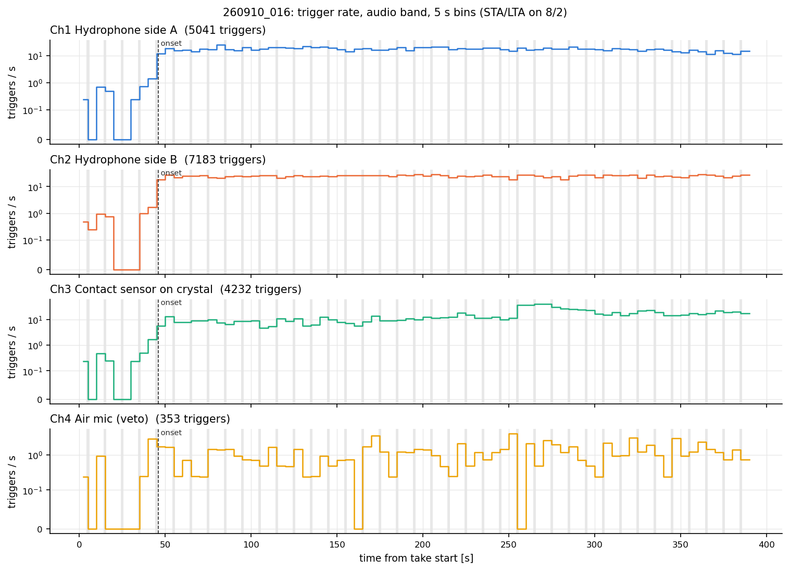
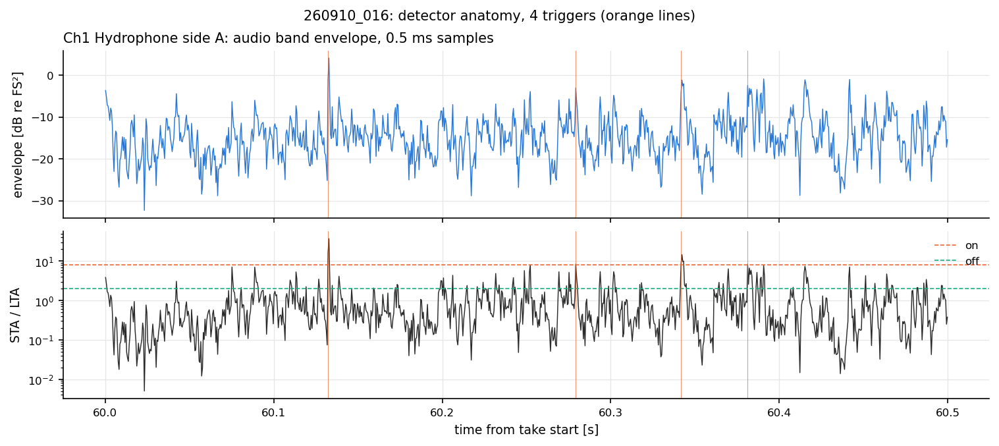
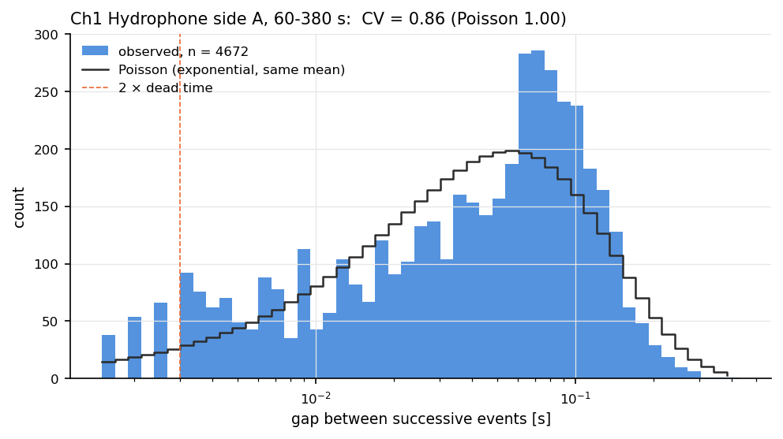
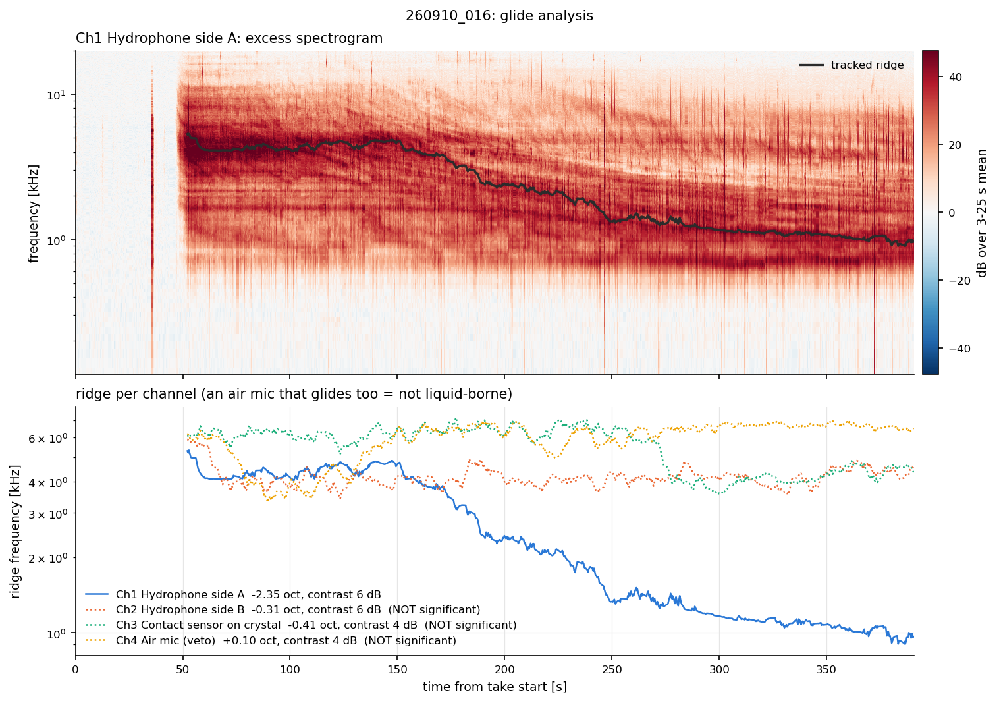

# Figure set: Sep-2026 take 260910_016 (EXP3, 0.5 M HCl, calcite): the strongest glide

Take `260910_016`, 390.9 s, 192000 Hz, channels [1, 2, 3, 4]. Baseline 3-25 s, 'after' window 60-380 s.

## 00 overview zoom

Ch1 Hydrophone side A: the whole take (masked time blank), band levels for context, and zooms chosen by the analysis: baseline, onset, loudest 30 s, a significant glide, and the strongest single event from the raw audio.

## 00b difference

Difference image: dB over the mean spectrum of the 3-25 s baseline. White = unchanged, red = added, blue = removed.

## 01 waveforms

Raw samples, 51.1-51.6 s, high-passed at 500 Hz. Each spike is one transient; look for dead or clipped channels.

## 02 spectrogram

Spectrogram per channel, dB re FS²/Hz, colour limits from the data (2nd-99.5th percentile). Masked time is not removed here, so chirps show as vertical stripes.

## 03 levels delta

Band levels in 1 s bins as change from the 3-25 s median. Grey = masked. The change, not the absolute dB, is comparable between channels.

## 04 spectra

Mean spectra, baseline vs after, and the excess (after minus baseline in linear power) as a dotted line. Grey band = 'rig' apparatus band.

## 05 trigger rate

STA/LTA trigger rate per live second, 5 s bins. A trigger is not a bubble: at high rates the count saturates.

## 06 detector

What the detector saw on Ch1 Hydrophone side A, 60-60.5 s: envelope, STA/LTA ratio, on/off thresholds, triggers.

## 07 interevent

Gaps between successive triggers against a Poisson process with the same mean (CV 1). Gaps across masked windows are excluded.

## 08 glide

Top: excess spectrogram (dB over the baseline spectrum) of the channel with the strongest ridge, with its track. Bottom: ridge per channel; dotted = not significant (median contrast under 6 dB).

## 08b glide interpretation

What the strongest ridge would require: a free or wall-attached growing bubble (radius vs the capillary length) or a bubbly layer (void fraction for assumed thicknesses). See docs/GLIDE_INTERPRETATION.md.

* `09_summary.csv`: per-channel numbers

## Per-channel summary

|   channel | label                         | sensor     |   onset_s |   baseline_dB |   low_delta_dB |   audio_delta_dB |   rig_delta_dB |   hb1_delta_dB |   trigger_rate_per_s |   glide_octaves |   glide_contrast_dB | glide_significant   |
|----------:|:------------------------------|:-----------|----------:|--------------:|---------------:|-----------------:|---------------:|---------------:|---------------------:|----------------:|--------------------:|:--------------------|
|         1 | Ch1 Hydrophone side A         | hydrophone |    47.125 |       -52.957 |          8.673 |           31.314 |         23.345 |          0.688 |               15.493 |          -2.354 |               6.373 | True                |
|         2 | Ch2 Hydrophone side B         | hydrophone |    46.125 |       -52.706 |         -0.103 |           36.889 |         39.507 |          1.873 |               22.076 |          -0.311 |               5.508 | False               |
|         3 | Ch3 Contact sensor on crystal | contact    |    48.375 |       -53.249 |          3.002 |           10.662 |         14.766 |          0.189 |               13.007 |          -0.415 |               4.314 | False               |
|         4 | Ch4 Air mic (veto)            | air        |   nan     |       -54.117 |          0.416 |            1.3   |          3.358 |          0.013 |                1.085 |           0.096 |               3.852 | False               |
